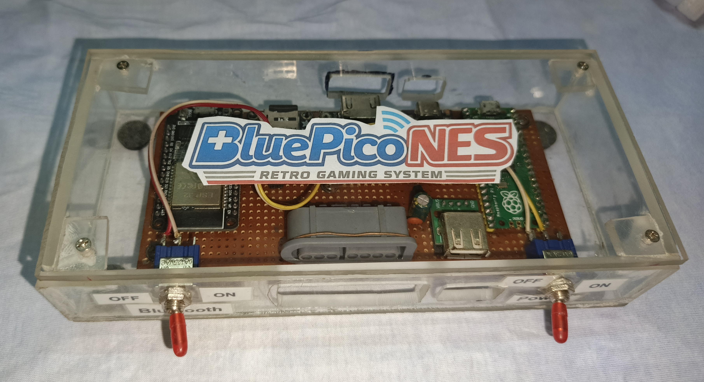
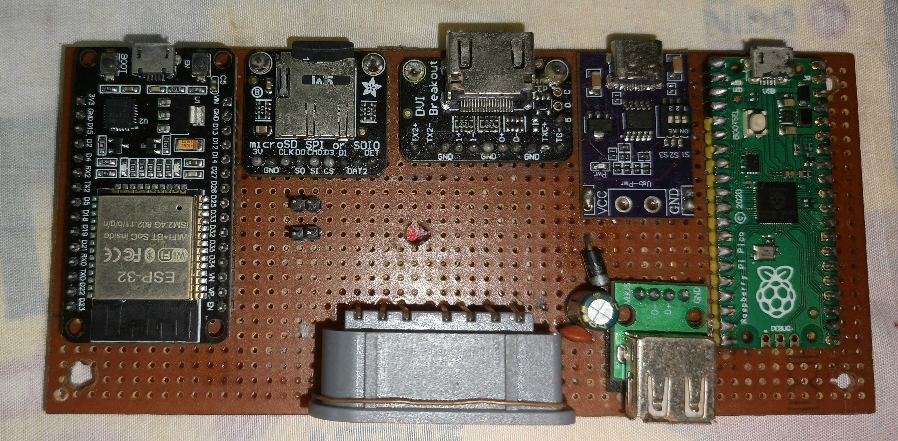
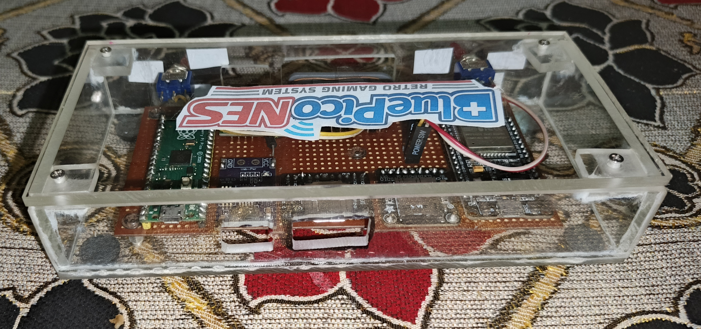

# BluePicoNES

> BluePicoNES is an open-source DIY retro gaming console based on Raspberry Pi Pico, PicoNES and BlueRetro with Bluetooth, USB and original NES/SNES controller support.

## Project Gallery

### Front View




### Internal View




### Rear View



## Hardware Used

- Raspberry Pi Pico
- ESP32-WROOM-32
- Adafruit DVI Breakout
- Adafruit MicroSD Breakout
- USB-C PD Module
- USB-A Host Port
- SS14 Schottky Diode
- 100nF Capacitor
- 47uF Capacitor
- Power Switch
- Bluetooth Switch

## Features

* NES Emulator (PicoNES)
* Bluetooth Controller Support (BlueRetro)
* Generic USB Controller Support
* Xbox 360 Wired Controller Support
* Xbox One Wired Controller Support
* Genuine NES Controller Support
* Genuine SNES Controller Support
* PS3 Controller Support
* PS4 Controller Support
* Dual Player Support
* HDMI/DVI Video Output
* microSD ROM Storage
* USB-C Power Input
* Custom Clear Case
* Fully Open-Source Hardware Project
* DIY Friendly Design
* Power Switch
* Bluetooth Enable/Disable Switch

## Project Status

✅ Fully Working

## License

MIT License

# Complete Wiring Table

## Power Connections

| Pico RP2040 | Connection |
|-------------|------------|
| VSYS | USB-C PD 5V Input |
| 3V3 | microSD VCC |
| 3V3 | NES/SNES Controller VCC |
| 3V3 | ESP32 3V3 |
| GND | Common Ground |

---

## microSD Breakout (SPI)

| Pico RP2040 | microSD Breakout |
|-------------|------------------|
| GP2 | CLK |
| GP3 | SI (MOSI) |
| GP4 | SO (MISO) |
| GP5 | CS |
| 3V3 | VCC |
| GND | GND |

---

## NES / SNES Controller Ports

### Player 1

| Pico RP2040 | Signal |
|-------------|--------|
| GP6 | Clock (P1) |
| GP7 | Data (P1) |
| GP8 | Latch (P1) |

### Player 2

| Pico RP2040 | Signal |
|-------------|--------|
| GP9 | Clock (P2) |
| GP10 | Data (P2) |
| GP11 | Latch (P2) |

---

## DVI Breakout

| Pico RP2040 | DVI Signal |
|-------------|------------|
| GP12 | O+ |
| GP13 | O− |
| GP14 | TXC+ |
| GP15 | TXC− |
| GP16 | TX2+ |
| GP17 | TX2− |
| GP18 | TX1+ |
| GP19 | TX1− |
| GND | GND |

---

## USB Host Port

| Pico RP2040 | USB-A |
|-------------|--------|
| TP2 | D− |
| TP3 | D+ |
| VSYS | VBUS (via Schottky Diode) |
| GND | GND |

### Additional Components

- SS14 Schottky Diode
- 100nF Ceramic Capacitor
- 47uF Electrolytic Capacitor

---

## ESP32 BlueRetro Interface

| ESP32 | Pico RP2040 |
|--------|-------------|
| IO5 | GP6 (Clock P1) |
| IO19 | GP7 (Data P1) |
| IO32 | GP8 (Latch P1) |
| IO18 | GP9 (Clock P2) |
| IO22 | GP10 (Data P2) |
| 3V3 | 3V3 |
| GND | GND |

---

## Switches

### Main Power Switch

USB-C PD 5V → Power Switch → Pico VSYS

### Bluetooth Switch

3V3 → Bluetooth Switch → ESP32 3V3

---

## Tested Features

- PicoNES
- BlueRetro
- Bluetooth Controller Support
- Generic USB Controller Support
- Xbox Wired Controller Support
- Genuine NES Controller Support
- Genuine SNES Controller Support
- PS3 Controller Support
- PS4 Controller Support
- Dual Player Support
- HDMI/DVI Output
- microSD ROM Loading

## Build Guide

This guide explains how to assemble, flash and configure the BluePicoNES console.

---

# 1. Flashing PicoNES Firmware

BluePicoNES uses the PicoNES firmware running on a Raspberry Pi Pico (RP2040).

### Download Firmware

Download the latest PicoNES release from:

https://github.com/fhoedemakers/pico-infonesPlus/releases

### Installation Steps

1. Disconnect power from the console.
2. Hold the **BOOTSEL** button on the Raspberry Pi Pico.
3. While holding BOOTSEL, connect the Pico to your PC using a USB cable.
4. The Pico will appear as a USB drive named **RPI-RP2**.
5. Download the latest `.uf2` firmware file from the PicoNES release page.
6. Drag and drop the `.uf2` file onto the **RPI-RP2** drive.
7. The Pico will automatically reboot after flashing.

### microSD Card Setup

1. Format the microSD card as **FAT32**.
2. Copy your NES ROM files (`.nes`) to the SD card.
3. Insert the card into the microSD breakout board.
4. Power on the console.

---

# 2. Flashing BlueRetro Firmware (ESP32)

BluePicoNES uses BlueRetro to provide Bluetooth controller support.

### Supported Controllers

* PS3 Controller
* PS4 DualShock 4
* Generic Bluetooth Controllers
* Other BlueRetro-compatible controllers

### Online Flasher

Open:

https://yakaracolombia.github.io/esp32-online-tool/blueretro.html

### Installation Steps

1. Connect the ESP32 board to your PC using a USB cable.
2. Open the BlueRetro Online Flasher page in Google Chrome or Microsoft Edge.
3. Click **Connect**.
4. Select the ESP32 serial port.
5. Choose the latest BlueRetro firmware.
6. Click **Install** and wait for flashing to complete.
7. Reboot the ESP32.

---

# 3. Hardware Assembly

### Main Components

* Raspberry Pi Pico
* ESP32-WROOM-32
* Adafruit DVI Breakout
* Adafruit microSD Breakout
* USB-C PD Power Module
* USB-A Host Port
* Power Switch
* Bluetooth Enable Switch

### Wiring

Follow the wiring table and diagrams included in this repository.

Pay special attention to:

* Power connections
* USB Host wiring
* DVI breakout connections
* microSD SPI wiring
* ESP32 BlueRetro wiring

---

# 4. Power-Up Checklist

Before powering on:

* Verify all GND connections
* Verify VSYS power rail
* Verify USB Host VBUS diode orientation
* Verify microSD wiring
* Verify DVI wiring
* Verify ESP32 power switch operation

---

# 5. First Boot

1. Insert the microSD card.
2. Connect HDMI/DVI display.
3. Connect USB controller or enable Bluetooth.
4. Power on BluePicoNES.
5. The PicoNES menu should appear on screen.

---

# 6. Bluetooth Controller Pairing

## Bluetooth Controller Pairing

### PS3 Controller (Sixaxis)

Unlike PS4 controllers, PS3 controllers require an additional pairing step before they can connect wirelessly to BlueRetro.

### Step 1 – Find the BlueRetro Bluetooth MAC Address

1. Power on BluePicoNES.
2. Connect to the BlueRetro Web Configurator:

   https://blueretro.io/

3. Open the Bluetooth settings page.
4. Locate and copy the Bluetooth MAC Address of your ESP32 BlueRetro device.

Example:

```text
AA:BB:CC:DD:EE:FF
```

---

### Step 2 – Download SixaxisPairTool

Download SixaxisPairTool:

https://sixaxispairtool.en.lo4d.com/windows

Install and launch the application.

---

### Step 3 – Write the BlueRetro MAC Address

1. Connect the PS3 controller to your PC using a USB cable.
2. Open SixaxisPairTool.
3. The current master address will be displayed.
4. Paste the BlueRetro Bluetooth MAC Address obtained from Step 1.
5. Click **Update** or **Write** to save the new address to the controller.

---

### Step 4 – Connect the Controller

1. Disconnect the PS3 controller from USB.
2. Power on BluePicoNES.
3. Press the **PS** button on the controller.
4. The controller should automatically connect to BlueRetro.

Once paired, the controller will reconnect automatically whenever BluePicoNES is powered on.

---

### PS4 DualShock 4

1. Power on BluePicoNES.
2. Hold **PS + SHARE** for several seconds.
3. The LED will begin flashing rapidly.
4. BlueRetro will automatically detect and pair the controller.
5. Once connected, the controller is ready to use.

---

### Supported Bluetooth Controllers

- PS3 Sixaxis / DualShock 3
- PS4 DualShock 4
- Various BlueRetro-compatible Bluetooth controllers

---

# 7. Tested Features

✅ NES Emulation

✅ microSD ROM Loading

✅ HDMI/DVI Video Output

✅ Bluetooth Controllers

✅ PS3 Controller

✅ PS4 Controller

✅ Generic USB Controllers

✅ Xbox Wired Controllers

✅ Genuine NES Controllers

✅ Genuine SNES Controllers

✅ Dual Player Support

---

Enjoy retro gaming with BluePicoNES!
## Credits

PicoNES:
https://github.com/fhoedemakers/pico-infonesPlus

BlueRetro:
https://github.com/darthcloud/BlueRetro

BlueRetro Online Flasher:
https://yakaracolombia.github.io/esp32-online-tool/blueretro.html
